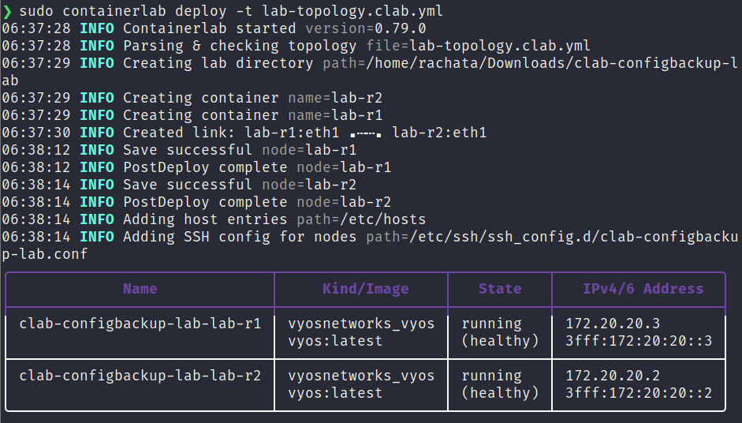
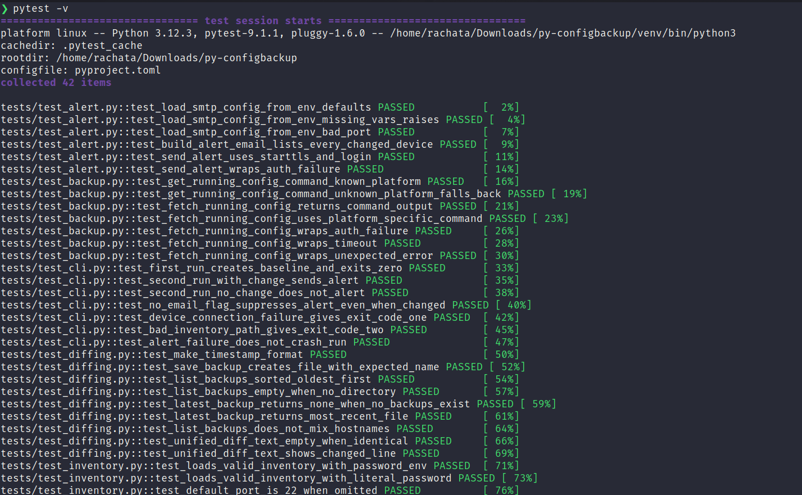
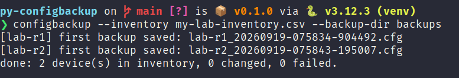
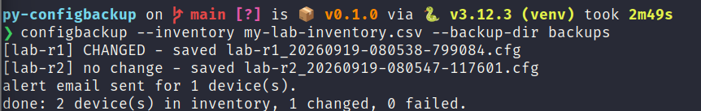
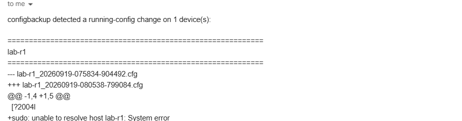
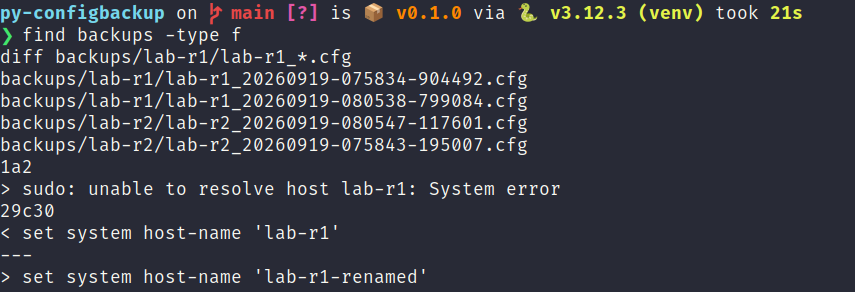

# RUNBOOK: Py-ConfigBackup

This is the step-by-step walkthrough for building the test lab, installing the tool, and running it for real on my Ubuntu machine. I wrote this so I can follow it top to bottom without having to remember anything, and so anyone else can reproduce the whole project from scratch.

Every command below is meant to be run on a real Ubuntu 22.04+ machine (or a VM), not in a sandbox. I'm using free tools the whole way through: containerlab, VyOS's own free rolling release, Python's standard library, and a free Gmail account for alerts.

## What I'm building

- A two-router lab (`lab-r1`, `lab-r2`) running VyOS, spun up with containerlab so I don't need any physical hardware or a paid lab subscription.
- A Python CLI (`configbackup`) that uses Netmiko to SSH into every device in an inventory file, pull its running configuration, save it as a timestamped file, and diff it against the last backup.
- An email alert (Gmail App Password + `smtplib`) that fires only when a diff is non-empty, so I'm not getting spammed every single run.

## Part 1: Install prerequisites

```bash
sudo apt update
sudo apt install -y python3 python3-venv python3-pip git docker.io
sudo systemctl enable --now docker
sudo usermod -aG docker $USER
```

Log out and back in (or run `newgrp docker`) after that last command so the group change takes effect. Confirm Docker works without `sudo`:

```bash
docker run hello-world
```

Install containerlab using its official install script:

```bash
sudo bash -c "$(curl -sL https://get.containerlab.dev)"
containerlab version
```

## Part 2: Build the VyOS container image

VyOS doesn't publish a ready-made Docker image, so containerlab's VyOS kind needs an image built from VyOS's own ISO. This is a one-time step. I'm using the free rolling release, not the paid LTS release, so there's no subscription involved.

1. Go to https://vyos.net/get/nightly-builds/ and download the current **rolling release ISO** (generic-amd64). The filename will look like `vyos-1.5-rolling-<date>-generic-amd64.iso`.

2. Extract the root filesystem from the ISO:

```bash
sudo apt install -y squashfs-tools-ng libarchive-tools
bsdtar -xf vyos-1.5-rolling-*-generic-amd64.iso live/filesystem.squashfs
sqfs2tar live/filesystem.squashfs > rootfs.tar
```

3. Create a `Dockerfile` in the same directory:

```dockerfile
FROM scratch
ADD rootfs.tar /
RUN for service in getty.target auditd.service; do systemctl mask $service; done && \
    systemctl disable kea-dhcp-ddns-server.service
HEALTHCHECK --start-period=10s CMD systemctl is-system-running
CMD ["/sbin/init"]
```

4. Build and tag the image:

```bash
docker build -t vyos:latest .
```

This step can take a few minutes the first time. If `docker build` fails partway through, check `docker images` to confirm the base layer got created, then re-run the build; Docker will reuse the cached layers.

## Part 3: Deploy the lab topology

Create `lab-topology.clab.yml`:

```yaml
name: configbackup-lab
topology:
  nodes:
    lab-r1:
      kind: vyosnetworks_vyos
      image: vyos:latest
    lab-r2:
      kind: vyosnetworks_vyos
      image: vyos:latest
  links:
    - endpoints: ["lab-r1:eth1", "lab-r2:eth1"]
```

Deploy it:

```bash
sudo containerlab deploy -t lab-topology.clab.yml
```

`containerlab deploy` prints a table with each node's management IP when it's done. Write those two IPs down, I need them for the inventory CSV in Part 6. Containerlab's management network is separate from the `eth1` link between the two routers, so these are the addresses I'll actually SSH to from my Ubuntu host.

**Screenshot 01:** the `containerlab deploy` output showing both nodes up with their management IPs.

<!-- screenshots/01-containerlab-deploy.png -->


## Part 4: Log in and enable SSH on each VyOS node

Default credentials for the VyOS containerlab image are `admin` / `admin`.

```bash
ssh admin@<lab-r1-management-ip>
```

Once logged in, VyOS should already be reachable over SSH (that's how I just connected), but I want to set my own password rather than leaving it on the default, since this inventory file is going to reference a real login:

```
configure
set system login user admin authentication plaintext-password 'ChangeThisPassword123'
set service ssh port 22
commit
save
exit
```

Repeat for `lab-r2`. If `commit` reports an error, run `show configuration commands` first to see what's already there. Don't skip `save`. VyOS keeps a running config and a separately-saved boot config, and only `save` writes it to disk so it survives a container restart.

## Part 5: Install the Python project

Back on the Ubuntu host, outside the containers:

```bash
git clone https://github.com/rachata072/py-configbackup.git
cd py-configbackup
python3 -m venv venv
source venv/bin/activate
pip install -e .
pip install -r requirements-dev.txt
```

Run the test suite before touching any real device. These tests use mocked Netmiko and mocked SMTP, so they don't need the lab to be up:

```bash
pytest -v
```

**Screenshot 02:** `pytest -v` output showing all tests passing.

<!-- screenshots/02-pytest-passing.png -->


## Part 6: Build the inventory file

Copy the example and edit it with the two management IPs from Part 3:

```bash
cp examples/inventory.csv my-lab-inventory.csv
```

`my-lab-inventory.csv`:

```csv
hostname,ip,device_type,port,username,password_env,secret_env
lab-r1,<lab-r1-management-ip>,vyos,22,admin,CONFIGBACKUP_LAB_R1_PASSWORD,
lab-r2,<lab-r2-management-ip>,vyos,22,admin,CONFIGBACKUP_LAB_R2_PASSWORD,
```

The CSV never holds the actual password, only the name of an environment variable that holds it. Those variables get set in Part 7, all together in one place, on purpose, keep reading before running anything.

## Part 7: Set up ALL credentials in one `.env` file

This is the step that's easy to get half-done across two different terminal sessions, so everything the tool needs (both device passwords from Part 4 and the Gmail alert settings) goes in a single file here, loaded with a single command, every time.

First, get a Gmail App Password if you haven't already:

1. On the Gmail account you want alerts sent from, turn on 2-Step Verification if it isn't already on (Google Account -> Security -> 2-Step Verification).
2. Go to Google Account -> Security -> 2-Step Verification -> App passwords.
3. Create a new App Password (any name, e.g. "configbackup"). Google generates a 16-character password, shown only once. That's what goes below as `CONFIGBACKUP_SMTP_APP_PASSWORD`, not your normal Gmail password.

Now create `.env` in the project folder (this file is git-ignored, it never gets committed):

```bash
cp .env.example .env
nano .env
```

Fill in all six values, your two VyOS device passwords from Part 4 AND your six Gmail settings, in this one file:

```bash
CONFIGBACKUP_LAB_R1_PASSWORD=the password you set on lab-r1 in Part 4
CONFIGBACKUP_LAB_R2_PASSWORD=the password you set on lab-r2 in Part 4

CONFIGBACKUP_SMTP_HOST=smtp.gmail.com
CONFIGBACKUP_SMTP_PORT=587
CONFIGBACKUP_SMTP_USERNAME=youraddress@gmail.com
CONFIGBACKUP_SMTP_APP_PASSWORD=xxxxxxxxxxxxxxxx
CONFIGBACKUP_ALERT_FROM=youraddress@gmail.com
CONFIGBACKUP_ALERT_TO=youraddress@gmail.com
```

No quotes needed around the values in a `.env` file. If any password happens to contain a `#`, keep in mind a `#` starts a comment in this file format, so wrap that one value in quotes if that ever comes up.

Load it into your current shell with `set -a` / `source` / `set +a`, not the `export $(... | xargs)` pattern, that older method breaks silently on any value containing a space, `#`, or `$`:

```bash
set -a
source .env
set +a
```

Do this every time you open a new terminal and want to run `configbackup`, environment variables never persist across terminal sessions on their own. Confirm everything loaded without printing the actual secrets:

```bash
for var in CONFIGBACKUP_LAB_R1_PASSWORD CONFIGBACKUP_LAB_R2_PASSWORD CONFIGBACKUP_SMTP_APP_PASSWORD; do
  echo "$var: $(echo -n "${!var}" | wc -c) characters"
done
```

Each should report a non-zero character count. `0` means that one didn't load, missing from `.env`, a typo in the variable name, or `.env` wasn't sourced in this shell.

## Part 8: Run the first backup (baseline)

```bash
configbackup --inventory my-lab-inventory.csv --backup-dir backups
```

On the very first run there's nothing to diff against, so both devices should just report "first backup saved" and no email gets sent. That's expected: the tool needs at least one prior backup before it can detect a change.

**Screenshot 03:** first run output, showing "first backup saved" for both devices.

<!-- screenshots/03-first-run-baseline.png -->


## Part 9: Make a real change and confirm the diff + alert

SSH back into `lab-r1` and change something small, like the hostname or an interface description:

```
configure
set system host-name lab-r1-renamed
commit
save
exit
```

Run the backup again:

```bash
configbackup --inventory my-lab-inventory.csv --backup-dir backups
```

This time `lab-r1` should print `CHANGED`, and (assuming Part 7's environment variables are set) an alert email should land in the inbox listing the diff.

**Screenshot 04:** CLI output showing `lab-r1` as CHANGED and `lab-r2` as no change.

<!-- screenshots/04-change-detected.png -->


**Screenshot 05:** the alert email itself, showing the diff in the body.

<!-- screenshots/05-alert-email.png -->


## Part 10: Look at the saved backups

```bash
find backups -type f
diff backups/lab-r1/lab-r1_*.cfg
```

Each device gets its own folder under `backups/`, and every run adds one more timestamped file. Nothing ever gets overwritten or deleted by the tool itself.

**Screenshot 06:** the backup file listing and the raw `diff` between `lab-r1`'s two backups.

<!-- screenshots/06.png -->


## Troubleshooting

**`NetmikoTimeoutException` / "connection timed out"**
The management IP is wrong, the container isn't up, or something on the host is blocking the connection. Run `sudo containerlab inspect -t lab-topology.clab.yml` to confirm both nodes are still running and check the IP again.

**`NetmikoAuthenticationException` / "authentication failed"**
Either the username/password in the CSV don't match what was actually set in Part 4, or the `password_env` variable isn't exported in the current shell (`echo $CONFIGBACKUP_LAB_R1_PASSWORD` to check).

**`show configuration commands` comes back empty or errors on VyOS**
Confirmed working as-is (no `run` prefix needed) against the VyOS rolling release used to build this lab, Netmiko's VyOS driver connects in operational mode by default, and the plain command returns the full config correctly. I'd flagged this as version-sensitive before actually testing it end to end; if a different VyOS build ever returns nothing, the fallback is changing `backup.py`'s `RUNNING_CONFIG_COMMANDS["vyos"]` to `"run show configuration commands"` and re-testing, but that wasn't needed here.

**A stray line like `sudo: unable to resolve host <name>: System error` or `[?2004l` shows up inside a saved backup**
This happened during real testing, `sudo` prints that hostname-resolution warning internally right after a `system host-name` change, and `[?2004l` is a terminal control sequence some shells emit, neither is part of the actual VyOS config. The current version of `backup.py` filters both patterns out automatically before saving or diffing (see `_strip_noise_lines`), so this shouldn't reappear, but if a different kind of terminal noise shows up on a different platform, add its pattern to `_NOISE_LINE_PATTERNS` in `backup.py` and a test encoding exactly what was observed, rather than guessing at every possible variant in advance.

**Gmail alert fails with `SMTPAuthenticationError`**
This almost always means an App Password wasn't used, or 2-Step Verification isn't turned on for the account (App Passwords require it). Double-check `CONFIGBACKUP_SMTP_APP_PASSWORD` is the 16-character App Password, not the regular account password.

**`docker build` fails on the VyOS image**
Usually means `bsdtar` or `sqfs2tar` didn't produce a valid `rootfs.tar` (check its file size, it should be several hundred MB). Re-run the extraction step and confirm the ISO downloaded completely (compare its size against the download page).

**Containerlab says a node's `kind` is unrecognized**
Confirm the containerlab version supports `vyosnetworks_vyos` (`containerlab version`); this kind was added in a relatively recent release, so an old install may need `containerlab version upgrade` first.

**Test suite passes but a real backup run silently pulls zero devices**
Almost always a typo in the inventory header row. The loader checks for the exact column names `hostname`, `ip`, `device_type`, `username`, so a stray space or wrong capitalization in the CSV header will make it think a required column is missing.

## Cleaning up the lab

```bash
sudo containerlab destroy -t lab-topology.clab.yml
```

This tears down both containers. The image built in Part 2 stays cached locally, so redeploying later with `containerlab deploy` again is fast.
